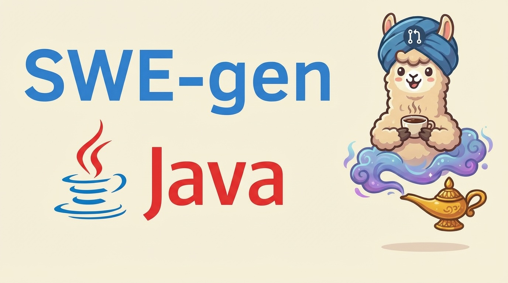
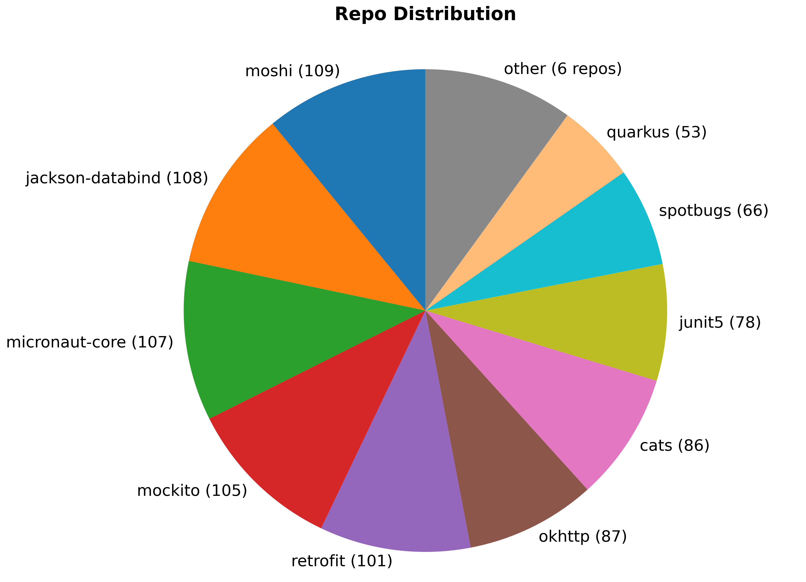

# SWE-gen-Java

<p align="center">
  <a href="https://github.com/abundant-ai/SWE-gen-JS">
    
  </a>
</p>

> 1000 JVM tasks generated from 16 open-source GitHub repos using [SWE-gen](https://github.com/abundant-ai/SWE-gen).

## Each task
- is a merged GitHub PR with 1-10 source files edited
- has Fail-to-Pass unit tests
- passes NOP (baseline fails) and Oracle (fix succeeds) validation

## Getting Started

Install [**Harbor**](https://github.com/laude-institute/harbor):

```shell
uv tool install harbor
```

Run with Codex:

```shell
export OPENAI_API_KEY=<YOUR-KEY> 
harbor run --dataset swe-gen-java \
   --agent codex \
   --model openai/gpt-5.2-codex \
   --n-concurrent 4
```

This command automatically downloads the tasks.

<p align="center">
  
</p>
